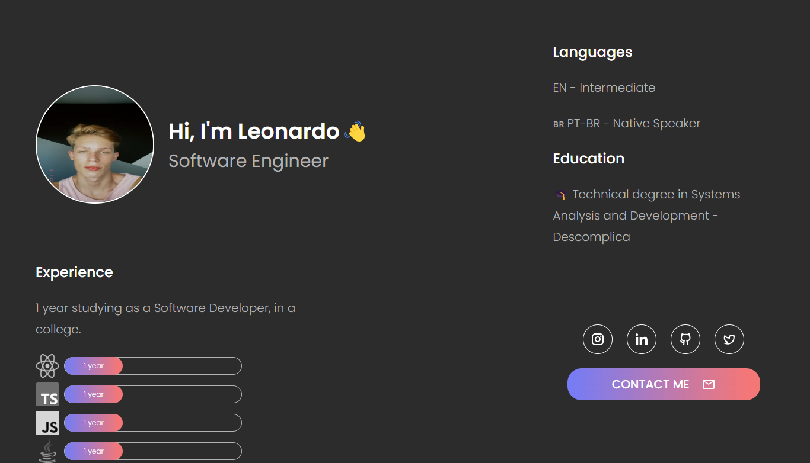

<h1> My Portfolio </h1>

BR: Este é um projeto de estudo executado acompanhando um tutorial no Youtube feito pela [Fernanda Kipper](https://www.youtube.com/watch?v=1tp7LMp0V28&pp=ygUPZmVybmFuZGEga2lwcGVy).  
EN: This is a study project based on a tutorial on Youtube made by [Fernanda Kipper](https://www.youtube.com/@kipperdev). 

 

## 😃 Preview site
  
#### Desktop

 

## 😊 Tecnologias usadas | Technologies used

- HTML e CSS
- Semantic HTML5 markup
- CSS/SCSS custom properties
- Flexbox
- React.Js
- Git e Github
- Figma

 

## 💫 Autor | Author

- GitHub - [@leocunhap](https://github.com/NicoleDPizetta)
- LinkedIn - [@Léo Cunha](https://www.linkedin.com/in/léoc-cunha/)

 

## 💫 Agradecimentos | Acknowledgments

BR: Agradeço à [Fernanda Kipper](https://www.youtube.com/@kipperdev) por disponibilizar este vídeo, o resultado ficou incrível. 🤩

EN: Thanks to [Fernanda Kipper](https://www.youtube.com/@kipperdev) for making this video available, the result was amazing. 🤩

---